# Claude Gateway Authentication Flow

```mermaid
flowchart LR
    A[User requests Claude tier access] --> B[SLX approves and adds user to an AD group]
    B --> C[AD group membership syncs to Entra]

    D[User runs Claude Code /login] --> E[CLI requests device sign-in from gateway]
    E --> F[Gateway returns a browser link and device code]
    F --> G[User opens gateway page and confirms the code]
    G --> H[Gateway redirects browser to Entra]
    C --> H
    H --> I[User authenticates with work account]
    I --> J[Entra returns authorization code to gateway callback]
    J --> K[Gateway exchanges code with Entra]
    K --> L[Entra returns signed identity token with configured claims]
    L --> M[Gateway validates token and checks allowed group]
    M --> N[Gateway issues its session token to Claude Code]

    N --> O[Claude Code sends model request to gateway]
    O --> P[Gateway applies group model policy and spend cap]
    P --> Q[Gateway uses ECS task role to call Bedrock]
    Q --> R[Bedrock response returns through gateway to Claude Code]
```

SLX manages the access request and AD group membership. Entra authenticates the user and supplies identity claims to the gateway. The gateway applies the user's group policy and calls Bedrock using its ECS task role; users do not receive AWS credentials or select an AWS role.

The AD group must be synchronized to Entra, and Entra must be configured to include the relevant group or role claim for the gateway application.